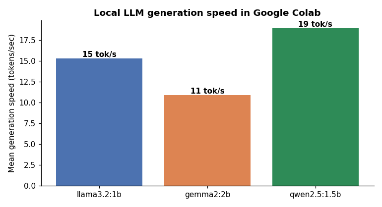

# 🦙 Running Open-Source LLMs Locally: Ollama & GPT4All

[](https://colab.research.google.com/github/MMujtabaX/gpt/blob/main/local_llms.ipynb)


Large language models without an API key: open-weight **Llama**, **Gemma** and **Qwen** models running on the same machine as the code, with no per-token cost and no data leaving the notebook. The project sets up an **Ollama** server inside Google Colab, chats with streaming and multi-turn memory, **benchmarks three small models** on speed and reasoning, extracts **structured JSON**, and runs a quantized **Llama 3 8B** with **GPT4All**.

<p align="center">
  
</p>

## 📊 Benchmark: Three Small Models

Same prompts, `temperature = 0`, speeds reported by Ollama:

| Model | Size on disk | Speed (tokens/sec) | Bat-and-ball puzzle |
|-------|-------------|--------------------|---------------------|
| **Qwen 2.5 1.5B** | 986 MB | **18.9** | ✅ $0.05 |
| Llama 3.2 1B | 1.3 GB | 15.3 | ✅ $0.05 (worked it out step by step) |
| Gemma 2 2B | 1.6 GB | 10.9 | ❌ $0.55 |

> **The puzzle:** *A bat and a ball cost $1.10. The bat costs $1.00 more than the ball. How much is the ball?* The intuitive answer, $0.10, is wrong; the correct answer is $0.05.

**Findings:**
- **The largest model was both the slowest and the only one to fail the reasoning test.** Size alone doesn't predict quality; training data and tuning matter.
- **Llama 3.2 1B solved it by writing out the algebra** (`2x + 1.00 = 1.10`). Step-by-step reasoning helps small models.
- **Qwen 2.5 1.5B** was the best all-rounder here: fastest, correct, and it wrote the most robust palindrome function (ignoring case and punctuation).

## ✨ What's Inside

### 1. Ollama in Colab
Installs the Ollama server, starts it in the background, waits until `localhost:11434` responds, then pulls three models. This fixes the classic `Connection refused` error you get when only the Python client is installed.

### 2. Streaming chat
```python
stream = ollama.chat(model='gemma2:2b', messages=[...], stream=True)
for chunk in stream:
    print(chunk['message']['content'], end='', flush=True)
```

### 3. Multi-turn memory
LLMs are stateless, so "memory" means resending the full conversation each time. In the demo, the follow-up *"How can I detect it?"* is only understood because the earlier question about **overfitting** is in the history.

### 4. Structured JSON output
`format='json'` constrains the model to valid JSON. Qwen 2.5 extracted this from a mixed product review:

```json
{
  "sentiment": "mixed",
  "pros": ["battery life is amazing", "screen is gorgeous"],
  "cons": ["overheats when gaming", "price is too high"]
}
```

### 5. Llama 3 8B with GPT4All
**4-bit quantization (Q4_0)** shrinks Llama 3 8B from about 16 GB to **4.66 GB**. GPT4All runs it directly inside Python, with no server. It produced a 200-token summary of 2024 AI use cases in **27.8 seconds** on CPU, and one decent joke:

> *Why do programmers prefer dark mode? Because light attracts bugs!*

## ⚖️ Ollama vs GPT4All

| | Ollama | GPT4All |
|--|--------|---------|
| Runs as | Background server + REST API | Library inside Python |
| Models | `ollama pull <name>` | Download by filename |
| Extras | JSON mode, many models side by side | Simple, no server to manage |
| Best for | Apps and services | Quick scripts, desktop use |

## 🔒 Local vs Cloud LLMs

- ✅ **Private:** data never leaves the machine
- ✅ **No API costs or rate limits**, and works offline
- ⚠️ **Small models make mistakes:** one failed a simple puzzle, and another listed regularization (a *prevention* method) when asked how to *detect* overfitting
- ⚠️ **Speed depends on your hardware** and the model size

## 🚀 Run It

1. Click the **Open in Colab** badge above.
2. Choose **Runtime → Change runtime type → T4 GPU** (CPU also works, just slower).
3. Choose **Runtime → Run all**. Models download automatically: about 4 GB for the three small models and 4.66 GB for Llama 3 8B.

GPT4All needs `pip install "gpt4all[cuda]"` plus a session restart to use the GPU. The notebook falls back to CPU automatically otherwise.

## 🔮 Next Steps

- A RAG chatbot over your own documents using a local model and embeddings
- A Gradio chat UI on top of Ollama
- Comparing quantization levels (Q4 vs Q8) for speed and quality

## 👤 Author

**Muhammad Mujtaba Khan Suri** — CS @ UBIT, University of Karachi
[GitHub](https://github.com/MMujtabaX)
